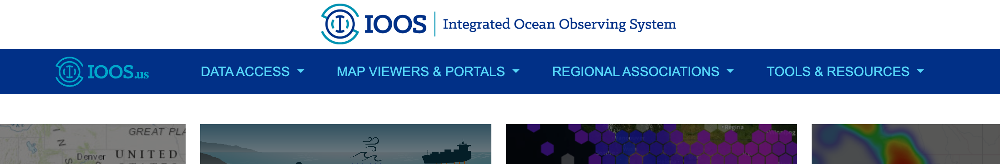
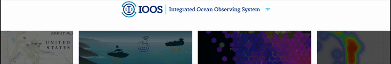

# IOOS Component Library
The IOOS UI Components library provides a customizable header and footer for IOOS applications. The component is easy to integrate into your web project and supports menu item customization through a simple configuration. It leverages [Shadow DOM](#shadow-dom) to encapsulate its internal structure and styles, ensuring consistent rendering and improved maintainability across different projects.
### Disclaimer

**This is a prototype.** The file locations, structures, and APIs are subject to change. Additionally, the design, including styling and responsiveness, is not yet finalized. The current implementation may undergo significant revisions as the project progresses. 

## Overview

This component library provides standardized header and footer components that maintain consistency across IOOS websites. It includes:

- Responsive header with navigation menu
- Footer with standardized links and information
- Bootstrap-based styling


# Usage (Production)

To use these components in your project:

1. Include the built CSS and JavaScript files in your HTML:
```html
<script src="https://dgd6r9iiqa8y9.cloudfront.net/ioos-ui-components.min.js">
```

2. Add the header and footer containers to your HTML:
```html
<div id="ioos-header"></div>
<!-- Your content here -->
<div id="ioos-footer"></div>
```

### Customizing the Menu
You can override the default menu items by passing a `menu-config` attribute to the `<ioos-header>` element. This attribute should contain a JSON string that defines your custom menu configuration.

#### Example
```html
<ioos-header menu-config='[
    {
        "id": "data",
        "title": "Custom Data",
        "items": [
            { "title": "Custom Metrics", "url": "https://example.com/metrics", "target": "_blank" },
            { "title": "Custom Search", "url": "https://example.com/search", "target": "_blank" }
        ]
    },
    {
        "id": "viewers",
        "title": "Custom Viewers",
        "items": [
            { "title": "Custom Viewer 1", "url": "/viewer1" }
        ]
    }
]'></ioos-header>
```

### Header variants (`variant`)

The `variant` attribute selects the header layout:

```html
<ioos-header></ioos-header>
<ioos-header variant="no-banner"></ioos-header>
<ioos-header variant="compact"></ioos-header>
```

| Value | Behavior |
|-------|----------|
| *(absent or `"default"`)* | Full header with emblem banner + blue navigation bar (default) |
| `"no-banner"` | Blue navigation bar only; the white emblem banner strip is hidden |
| `"compact"` | Only the emblem banner (55px) is visible with a light blue caret; on desktop, hovering slides the blue navigation bar down below the banner, and on mobile, tapping the banner toggles the menu |

> Note: `ioos-banner="off"` is a deprecated alias for `variant="no-banner"` and is kept for backward compatibility. It is ignored when a `variant` is set.

### Theme (`theme`)

The `theme` attribute controls the banner color scheme:

```html
<ioos-header></ioos-header>
<ioos-header theme="light"></ioos-header>
<ioos-header theme="dark"></ioos-header>
<ioos-header theme="auto"></ioos-header>
```

| Value | Behavior |
|-------|----------|
| *(absent or `"light"`)* | Light banner (default) |
| `"dark"` | Dark banner background |
| `"auto"` | **Experimental / limited support.** Detects the host page's theme and live-updates when it changes. See below. |

#### `theme="auto"` (experimental, limited support)

`theme="auto"` currently only detects:

1. `data-theme="light|dark"` on the `<html>` element
2. The OS/browser level `prefers-color-scheme` media query, as a fallback

Other conventions (e.g. Tailwind's `<html class="dark">`) are **not** detected yet. More detection strategies will be added as neeeded; if your site uses a different convention, please open an issue.

#### Visual comparison

**Default:**



**Compact:**



## Reference Menu Configuration
If you prefer not to use the built-in menu component but want to ensure your menu is synchronized with the standard IOOS menu, you can use our reference `menuConfig.json`.
#### Reference Menu Config
The `headerMenuConfig.json` file is available at from this Github Repo, or through [Cloudfront CDN](https://dgd6r9iiqa8y9.cloudfront.net/headerMenuConfig.json)

You can pull down JSON file as a reference dynamically or during your build process for your own menu configuration.


# Development

## Installation

1. Clone the repository

2. Navigate to Component Libary
```bash
cd ioos-us/component-library
```

2. Install dependencies:
```bash
npm install
```

To start the development server:

```bash
npm start
```

This will start a local development server with hot-reloading enabled.


## Project Structure

```
ioos-us/component-library/
├── src/
│   ├── header.js        # Header component implementation
│   ├── header.css       # Header styles
│   ├── footer.js        # Footer component implementation
│   ├── footer.css       # Footer styles
│   └── bootstrap.min.css # Bootstrap framework
├── assets/             # Static assets
├── build/             # Production build output
├── webpack.config.js  # Webpack configuration
└── package.json       # Project dependencies and scripts
```

## Configuration

The header menu configuration can be customized by modifying the `headerMenuConfig.json` file.


# Shadow DOM

This component uses Shadow DOM to encapsulate its internal structure and styles. Shadow DOM provides several advantages when implementing the component into your website:

- **Encapsulation**: Shadow DOM encapsulates the component's internal DOM structure and styles, preventing them from affecting the global styles of your application. This means that the styles inside `<ioos-header>` and `<ioos-footer>` won’t interfere with or be overridden by your site's styles, ensuring consistent rendering.

- **Scoped Styles**: The styles defined within the Shadow DOM are scoped to the component, preventing global styles from unintentionally affecting the component and vice versa. This makes the component highly modular and easier to integrate into various projects without worrying about style conflicts.

- **Improved Maintainability**: By isolating the component’s implementation details, Shadow DOM makes the component easier to maintain and update. You can confidently modify the component’s internal structure and styles without worrying about breaking other parts of your application.

## Customizing Styles Inside Shadow DOM

While Shadow DOM provides strong encapsulation, it also means that external styles cannot directly modify elements within the Shadow DOM. A style override parameter can be implemented for these components, however if the styling change is bug-related, you can report the issue.

# Deployment

The component library is deployed using a GitHub Actions workflow. The deployment process is automated and handles building, uploading to S3, and invalidating the CloudFront cache.

## Deployment Process

1. Go to the "Actions" tab in the GitHub repository
2. Select "Deploy Component Library" workflow
3. Click "Run workflow"

The workflow will:
- Build the component library using webpack
- Upload the minified JavaScript file (`ioos-ui-components.min.js`) to S3
- Upload the menu configuration file (`headerMenuConfig.json`) to S3
- Invalidate the CloudFront cache for both files

The deployed files will be available at:
- JavaScript: `https://dgd6r9iiqa8y9.cloudfront.net/ioos-ui-components.min.js`
- Menu Config: `https://dgd6r9iiqa8y9.cloudfront.net/headerMenuConfig.json`